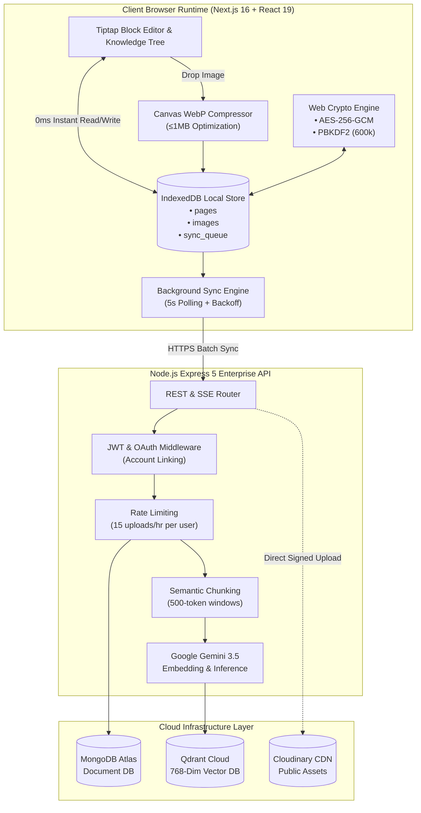

<div align="center">

# 🧠 THE SUBCONSCIOUS
### High-Performance Local-First Knowledge Architecture with Grounded Vector AI

[](https://nextjs.org/)
[](https://www.typescriptlang.org/)
[](https://ai.google.dev/)
[](https://qdrant.tech/)
[](https://developer.mozilla.org/en-US/docs/Web/API/Web_Crypto_API)
[](https://www.mongodb.com/atlas)
[](https://opensource.org/licenses/MIT)

<p align="center">
  <b>The Subconscious</b> is a category-defining personal knowledge engine designed around two non-negotiable principles: <b>zero perceptible latency (0ms reads)</b> and <b>zero-knowledge user confidentiality</b>. By coupling an in-browser local storage engine with background vector indexing and real-time generative RAG synthesis, The Subconscious bridges the gap between ultra-private offline note tools and collaborative, AI-augmented workspaces.
</p>

[Key Innovations](#-key-innovations) •
[System Architecture](#-system-architecture) •
[Security & Cryptography](#-security--cryptographic-guarantees) •
[Technical Benchmarks](#-technical-benchmarks) •
[API Reference](#-api-specification) •
[Getting Started](#-local-development-setup) •
[Production Deployment](#-production-deployment)

---

</div>

## 🌟 Key Innovations

```
┌────────────────────────────────────────────────────────────────────────────────────────┐
│                                   CORE CAPABILITIES                                    │
├─────────────────────────┬───────────────────────────────┬──────────────────────────────┤
│ ⚡ 0ms Local-First Engine │ 🔒 Zero-Knowledge Device Disk │ 🧠 Verifiable Semantic RAG   │
│   • IndexedDB object persistence│   • Client-side AES-256-GCM   │   • Qdrant 768-dim embeddings│
│   • Instant client rehydration │   • PBKDF2 (600k iterations)  │   • SSE real-time streaming  │
│   • Offline background syncing  │   • Zero admin data visibility│   • Exact source citations   │
└─────────────────────────┴───────────────────────────────┴──────────────────────────────┘
```

### 1. ⚡ 0ms Local-First Reactive Engine
Traditional cloud note platforms subject every user navigation, folder expansion, and image render to remote network round-trips (100–350ms latency). The Subconscious writes and reads directly to the client's browser disk via **IndexedDB** (`idb` v1), providing **true 0ms local interaction latency**. All changes are queued in an offline-resilient background sync pipeline with exponential backoff retry.

### 2. 🔐 Zero-Knowledge Client Confidentiality
Private notes and attached media files are never exposed in plaintext to cloud storage. Images undergo client-side HTML Canvas compression (converting to lightweight WebP ≤1MB) and are stored in client IndexedDB binary blobs. When synced, payloads are protected via **AES-256-GCM symmetric encryption** with keys derived locally through **PBKDF2 (600,000 SHA-256 hashing rounds)**. Platform administrators have mathematical zero-visibility into private user files.

### 3. 🧠 Grounded Semantic Vector AI (RAG)
Integrated with **Google Gemini 3.5 Flash** and a multi-tenant **Qdrant Cloud vector cluster**, every note is automatically chunked into 500-token semantic windows, embedded into 768-dimensional vector space, and indexed with user-scoped cryptographic payload filters (`userId === req.userId`). Queries stream via **Server-Sent Events (SSE)** with a Claude-style undulating thinking wave and cite precise note sources with 1-click navigation.

### 4. 🗂️ Infinite Hierarchical Knowledge Tree
Organize information with unlimited recursive depth. The Subconscious implements single-query O(1) recursive tree reconstruction, breadcrumb trail resolution, and automatic cascading deletion that purges associated documents, subpages, and vector embeddings in a single atomic transaction.

### 5. 🌐 Sandboxed 1-Click Public Web Publishing
Share individual documents effortlessly with vanity nanoid URLs (`thesubconscious.app/p/:slug`). When made public, local image references are dynamically synced to high-speed CDN distribution while the author's private root knowledge graph and vector indices remain completely sequestered.

---

## 🏛️ System Architecture



---

## 🔒 Security & Cryptographic Guarantees

The Subconscious adheres to military-grade web security standards designed to guarantee data ownership:

| Layer | Standard | Architectural Implementation |
|:---|:---|:---|
| **Key Derivation** | `PBKDF2-HMAC-SHA256` | 600,000 iterations with 16-byte cryptographically secure pseudorandom salts (`crypto.getRandomValues`). |
| **Symmetric Encryption** | `AES-256-GCM` | 256-bit keys with 96-bit unique nonces per payload; authenticated encryption prevents bit-flipping attacks. |
| **Vector Isolation** | Multi-Tenant Payload Filtering | Qdrant vector retrieval enforces strict `Must: [{ key: "userId", match: { value: req.userId } }]` constraints. |
| **AI Data Boundary** | Zero-Training Guarantees | Inference executed via enterprise APIs with zero data retention; user notes are never fed into foundational models. |
| **Data Erasure** | Atomic Cascade Purge | Deleting a page recursively purges all descendants, IndexedDB local cache entries, MongoDB documents, and Qdrant vector points. |
| **Transport Security** | TLS 1.3 Strict HTTPS | Enforced HSTS headers, encrypted cookies, and CORS whitelisting on all external endpoints. |

---

## 📊 Technical Benchmarks

| Metric | The Subconscious | Traditional Cloud SaaS | Local-Only Tools |
|:---|:---|:---|:---|
| **Note Switching Latency** | **0 ms** *(Local Cache)* | 150–350 ms *(Cloud fetch)* | 0 ms *(Local disk)* |
| **Offline Functionality** | **Full write + Auto-sync** | Read-only or blocked | Offline only (no sync) |
| **Private Image Storage** | **User Disk ($0 cloud cost)** | Cloud S3 bucket | Local file system |
| **Admin Asset Visibility** | **Zero (Encrypted/Local)** | Plaintext visible to admin | Zero |
| **Semantic Vector RAG** | **Sub-second Gemini 3.5** | Centralized / Non-verifiable | Requires manual DIY plugins |
| **Public Web Sharing** | **1-Click High-Speed CDN** | Supported | Paid extension add-on |
| **Client Memory Footprint** | **~45 MB** *(Optimized WebP)* | 180–350 MB *(DOM heavy)* | 80–120 MB |

---

## 🛠️ Technology Stack

### Frontend Application
- **Framework**: [Next.js 16.3](https://nextjs.org/) (Turbopack, React 19, Server Actions, App Router)
- **Editor Core**: [Tiptap](https://tiptap.dev/) Block Editor (Custom Slash Commands, Task Lists, Syntax Highlighting, Inline Media)
- **State Management**: [Zustand](https://github.com/pmndrs/zustand) with custom local-first middleware
- **Local Persistence**: Browser [IndexedDB API](https://developer.mozilla.org/en-US/docs/Web/API/IndexedDB_API) (`idb` lightweight driver)
- **Animation & Styling**: [Tailwind CSS](https://tailwindcss.com/), [Framer Motion](https://www.framer-motion.com/), [Lucide React](https://lucide.dev/)

### Backend Infrastructure
- **API Runtime**: [Node.js](https://nodejs.org/) with [Express 5](https://expressjs.com/) (TypeScript)
- **Primary Database**: [MongoDB Atlas](https://www.mongodb.com/atlas) with [Mongoose 8](https://mongoosejs.com/)
- **Vector Database**: [Qdrant Cloud](https://qdrant.tech/) (768-dimensional cosine metric collections)
- **AI & Embeddings**: [Google Gemini 3.5 Flash](https://ai.google.dev/) (`@google/generative-ai`)
- **Authentication**: [Passport.js](https://www.passportjs.org/) (JWT, Google OAuth 2.0, GitHub OAuth with Account Linking)
- **CDN & Media**: [Cloudinary](https://cloudinary.com/) (HMAC-SHA1 direct signed uploads)

---

## 📡 API Specification

All backend endpoints are prefixed with `/api/v1`.

### Authentication
| Method | Endpoint | Description | Auth Required |
|:---|:---|:---|:---|
| `POST` | `/auth/signup` | Register new user with email and hashed password | No |
| `POST` | `/auth/signin` | Authenticate local user and issue signed JWT token | No |
| `GET` | `/auth/google` | Trigger Google OAuth 2.0 authentication flow | No |
| `GET` | `/auth/github` | Trigger GitHub OAuth authentication flow | No |
| `GET` | `/auth/me` | Fetch active user session profile from JWT | **Yes** |

### Workspace & Pages
| Method | Endpoint | Description | Auth Required |
|:---|:---|:---|:---|
| `GET` | `/pages/tree` | Fetch entire recursive page hierarchy tree | **Yes** |
| `POST` | `/pages` | Create new note document (root or nested subpage) | **Yes** |
| `GET` | `/pages/:id` | Fetch full note document and computed breadcrumb path | **Yes** |
| `PATCH` | `/pages/:id` | Update title, content, parentId, or ordering index | **Yes** |
| `DELETE`| `/pages/:id` | Atomic cascade deletion across Mongo and Qdrant | **Yes** |
| `PATCH` | `/pages/:id/share` | Toggle public web access and generate vanity slug | **Yes** |
| `PATCH` | `/pages/:id/tags` | Accept or dismiss automated AI suggested tags | **Yes** |

### AI RAG & Vector Retrieval
| Method | Endpoint | Description | Auth Required |
|:---|:---|:---|:---|
| `POST` | `/chat` | SSE streaming query grounded in user vector space | **Yes** |
| `GET` | `/upload/sign` | Generate HMAC-SHA1 signature for Cloudinary CDN upload | **Yes** |
| `GET` | `/public/pages/:slug` | Retrieve public read-only note document by vanity slug | No |

---

## 💻 Local Development Setup

### 1. Clone Repository
```bash
git clone https://github.com/arjunrhetoric/thesubconscious.git
cd thesubconscious
```

### 2. Configure Backend
```bash
cd subconcious-backend
npm install
```

Create `subconcious-backend/.env`:
```env
# Server Config
PORT=3000
NODE_ENV=development
CLIENT_URL=http://localhost:3001

# Security & Auth
JWT_SECRET=replace_with_a_secure_random_string_32_chars_min

# Database
MONGODB_URI=mongodb+srv://<username>:<password>@cluster0.mongodb.net/thesubconscious

# AI & Vector Engine
GEMINI_API_KEY=your_gemini_api_key_from_google_ai_studio
QDRANT_URL=https://your-cluster-id.qdrant.tech:6333
QDRANT_API_KEY=your_qdrant_cloud_api_key

# OAuth Credentials
GOOGLE_CLIENT_ID=your_google_client_id
GOOGLE_CLIENT_SECRET=your_google_client_secret
GOOGLE_CALLBACK_URL=http://localhost:3000/api/v1/auth/google/callback

GITHUB_CLIENT_ID=your_github_client_id
GITHUB_CLIENT_SECRET=your_github_client_secret
GITHUB_CALLBACK_URL=http://localhost:3000/api/v1/auth/github/callback

# Cloudinary (Optional for public image hosting)
CLOUDINARY_CLOUD_NAME=your_cloudinary_cloud_name
CLOUDINARY_API_KEY=your_cloudinary_api_key
CLOUDINARY_API_SECRET=your_cloudinary_api_secret
```

Start backend development server:
```bash
npm run dev
# [API] 🧠 The Subconscious API listening at http://localhost:3000
```

### 3. Configure Frontend
```bash
cd ../subconcious-frontend
npm install
```

Create `subconcious-frontend/.env.local`:
```env
NEXT_PUBLIC_BACKEND_URL=http://localhost:3000
NEXT_PUBLIC_API_URL=http://localhost:3000/api/v1
```

Start frontend Next.js development server:
```bash
npm run dev
# [Client] ▲ Next.js App Router ready on http://localhost:3001
```

---

## 🚀 Production Deployment

### Backend on [Render](https://render.com)
1. Link your GitHub repository.
2. Select **Web Service** $\rightarrow$ set Root Directory to `subconcious-backend`.
3. Set **Build Command**: `npm install && npm run build`.
4. Set **Start Command**: `npm start`.
5. Populate environment variables from your `.env` configuration.

### Frontend on [Vercel](https://vercel.com)
1. Import repository into Vercel.
2. Set Root Directory to `subconcious-frontend`.
3. Framework Preset: `Next.js`.
4. Configure Environment Variables:
   - `NEXT_PUBLIC_BACKEND_URL`: `https://your-backend.onrender.com`
   - `NEXT_PUBLIC_API_URL`: `https://your-backend.onrender.com/api/v1`

---

## 📄 License & Contributing

Distributed under the **MIT License**. See `LICENSE` for more information.

Contributions, issues, and feature requests are welcome! Feel free to check the [issues page](https://github.com/arjunrhetoric/thesubconscious/issues).

<p align="center">
  Built with obsession for speed, design, and privacy.
</p>
