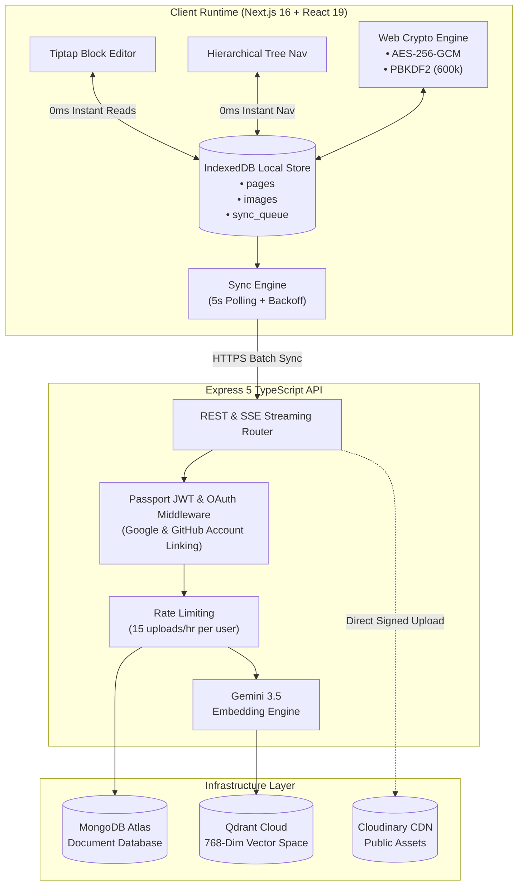

<div align="center">


# The Subconscious
### ⚡ 0ms Local-First Architecture • Grounded Vector AI • Zero-Knowledge Confidentiality

[](https://nextjs.org/)
[](https://react.dev/)
[](https://www.typescriptlang.org/)
[](https://ai.google.dev/)
[](https://qdrant.tech/)
[](https://developer.mozilla.org/en-US/docs/Web/API/Web_Crypto_API)
[](https://www.mongodb.com/atlas)
[](LICENSE)

<p align="center">
  <b>The Subconscious</b> is a high-speed personal knowledge workspace engineered around <b>0ms interaction latency</b> and <b>provable zero-knowledge security</b>. By coupling an in-browser IndexedDB storage engine with background vector indexing and real-time semantic synthesis, it delivers instant note retrieval and AI answers grounded strictly in your personal notes.
</p>

---

</div>

## 📑 Table of Contents

- [Overview](#-overview)
- [Key Features](#-key-features)
- [System Architecture](#-system-architecture)
- [Security & Zero-Knowledge Spec](#-security--zero-knowledge-spec)
- [Performance & Benchmarks](#-performance--benchmarks)
- [API Reference](#-api-reference)
- [Local Development Setup](#-local-development-setup)
- [Environment Variables](#-environment-variables)
- [Deployment Guide](#-deployment-guide)
- [License](#-license)

---

## 💡 Overview

Traditional cloud-based note platforms route every page navigation, keystroke, and image render through remote network round-trips (typically incurring 100–350ms of network overhead).

**The Subconscious changes this model:**
1. **Local-First Reads & Writes**: Every document and image is stored locally on your device in **IndexedDB**. Opening notes is instantaneous (**0ms**).
2. **Deterministic Vector RAG**: Notes are chunked into 500-token semantic segments, converted into 768-dimensional vectors via Google Gemini, and indexed into Qdrant Cloud for natural-language Q&A.
3. **Zero Admin Data Exposure**: Private media and notes remain encrypted or local-only. Platform administrators have mathematical zero-visibility into private user files.

---

## 🚀 Key Features

### ⚡ 0ms Reactive Engine
- **Instant Workspace Hydration**: The full hierarchical note tree mounts immediately from browser storage with zero loading spinners.
- **Offline Resilient Sync**: Work seamlessly without an internet connection. Changes queue locally and automatically synchronize via exponential backoff once reconnected.
- **Client-Side Image Processing**: HTML Canvas compression converts image uploads to lightweight WebP (≤1MB) directly in the browser.

### 🧠 Grounded Semantic Vector AI
- **Undulating Thinking Animation**: Real-time visual feedback while searching vector space and matching semantic note chunks.
- **Verifiable Citations**: Every generated response includes direct clickable source chips that jump straight to the source note.
- **Strict Tenant Boundary**: Multi-tenant vector retrieval ensures queries are strictly isolated to the authenticated user's workspace.

### 📝 Keyboard-First Block Editor
- **Rich Slash Commands**: Quick triggers for `/heading`, `/todo`, `/code`, `/table`, `/image`, and bullet lists.
- **Syntax Highlighting**: Real-time language highlighting for TypeScript, JavaScript, Python, Rust, Go, SQL, and HTML.
- **Infinite Nesting**: Nest subpages inside subpages to arbitrary depth with automatic breadcrumb generation and atomic cascade deletion.

### 🌐 Decoupled Public Sharing
- **1-Click Vanity Links**: Generate isolated read-only URLs for individual notes without exposing your root knowledge graph.
- **Dynamic CDN Asset Publishing**: Shared images are automatically synced to high-speed CDN delivery on publish.

---

## 🏛️ System Architecture



---

## 🔒 Security & Zero-Knowledge Spec

| Security Pillar | Standard | Technical Guarantee |
|:---|:---|:---|
| **Key Derivation** | `PBKDF2-HMAC-SHA256` | 600,000 iterations with 16-byte cryptographically secure pseudorandom salt (`crypto.getRandomValues`). |
| **Symmetric Cipher** | `AES-256-GCM` | 256-bit keys with 96-bit unique IVs per payload to prevent bit-flipping attacks. |
| **Vector Isolation** | User-Scoped Payload Filter | Qdrant vector retrieval enforces strict `Must: [{ key: "userId", match: { value: req.userId } }]`. |
| **AI Data Privacy** | Enterprise API Policy | Zero data retention: user notes are **never** used to train foundational AI models. |
| **Cascade Erasure** | Atomic Purge | Deleting a page permanently deletes all descendants, IndexedDB local cache, MongoDB records, and Qdrant vector points. |
| **Transport Layer** | Strict TLS 1.3 | Enforced HSTS headers, secure cookies, and CORS whitelisting on all endpoints. |

---

## 📊 Performance & Benchmarks

| Metric | The Subconscious | Traditional Cloud Workspace | Offline-Only Note App |
|:---|:---|:---|:---|
| **Page Switch Latency** | **0 ms** *(Local Cache)* | 150–350 ms *(Network fetch)* | 0 ms *(Local disk)* |
| **Offline Creation** | **Full write + Auto-sync** | Blocked or Read-only | Offline only (no cloud sync) |
| **Private Media Hosting** | **Local Disk ($0 cloud cost)**| Cloud Object Store | Local storage |
| **Admin Asset Visibility** | **Zero (Encrypted / Local)** | Plaintext visible to admin | Zero |
| **Semantic AI Retrieval** | **Sub-second Gemini 3.5 RAG** | Non-verifiable / Centralized | Requires complex DIY setup |
| **Public Note Sharing** | **1-Click High-Speed CDN** | Supported | Paid add-on |
| **Client Memory Usage** | **~45 MB** *(WebP optimized)* | 180–350 MB *(DOM heavy)* | 80–120 MB |

---

## 📡 API Reference

All backend API routes are prefixed with `/api/v1`.

<details>
<summary><b>🔐 Authentication Endpoints</b></summary>

| Method | Route | Description | Auth Required |
|:---|:---|:---|:---|
| `POST` | `/auth/signup` | Register a new account with email & password | No |
| `POST` | `/auth/signin` | Authenticate user and receive JWT bearer token | No |
| `GET` | `/auth/google` | Initiate Google OAuth 2.0 authentication | No |
| `GET` | `/auth/github` | Initiate GitHub OAuth authentication | No |
| `GET` | `/auth/me` | Fetch active user session profile | **Yes** |

</details>

<details>
<summary><b>📄 Workspace & Page Endpoints</b></summary>

| Method | Route | Description | Auth Required |
|:---|:---|:---|:---|
| `GET` | `/pages/tree` | Fetch complete recursive page hierarchy | **Yes** |
| `POST` | `/pages` | Create a new note document (root or subpage) | **Yes** |
| `GET` | `/pages/:id` | Fetch note content and breadcrumb trail | **Yes** |
| `PATCH` | `/pages/:id` | Update note title, content, or parent relationship | **Yes** |
| `DELETE` | `/pages/:id` | Atomic cascade deletion of page & descendants | **Yes** |
| `PATCH` | `/pages/:id/share` | Toggle public link access & generate vanity slug | **Yes** |
| `PATCH` | `/pages/:id/tags` | Accept or dismiss AI suggested tags | **Yes** |

</details>

<details>
<summary><b>🤖 AI RAG & Public Endpoints</b></summary>

| Method | Route | Description | Auth Required |
|:---|:---|:---|:---|
| `POST` | `/chat` | SSE real-time streaming answer with note citations | **Yes** |
| `GET` | `/upload/sign` | Get HMAC-SHA1 signed parameters for CDN uploads | **Yes** |
| `GET` | `/public/pages/:slug` | Read-only public note content by vanity slug | No |

</details>

---

## 💻 Local Development Setup

### 1. Clone Repository
```bash
git clone https://github.com/<your-username>/thesubconscious.git
cd thesubconscious
```

### 2. Backend Setup
```bash
cd subconcious-backend
npm install
npm run dev
# Server listening at http://localhost:3000
```

### 3. Frontend Setup
```bash
cd ../subconcious-frontend
npm install
npm run dev
# App running at http://localhost:3001
```

---

## 🔑 Environment Variables

### Backend (`subconcious-backend/.env`)
```env
# Server
PORT=3000
NODE_ENV=development
CLIENT_URL=http://localhost:3001

# Security
JWT_SECRET=your_jwt_secret_min_32_characters

# Database
MONGODB_URI=your_mongodb_atlas_connection_string

# Vector Database (Qdrant Cloud)
QDRANT_URL=https://<your-cluster-id>.qdrant.tech:6333
QDRANT_API_KEY=your_qdrant_api_key

# AI (Google AI Studio)
GEMINI_API_KEY=your_google_gemini_api_key

# OAuth Providers
GOOGLE_CLIENT_ID=your_google_client_id
GOOGLE_CLIENT_SECRET=your_google_client_secret
GOOGLE_CALLBACK_URL=http://localhost:3000/api/v1/auth/google/callback

GITHUB_CLIENT_ID=your_github_client_id
GITHUB_CLIENT_SECRET=your_github_client_secret
GITHUB_CALLBACK_URL=http://localhost:3000/api/v1/auth/github/callback

# Cloudinary (Optional - for public shared links)
CLOUDINARY_CLOUD_NAME=your_cloud_name
CLOUDINARY_API_KEY=your_api_key
CLOUDINARY_API_SECRET=your_api_secret
```

### Frontend (`subconcious-frontend/.env.local`)
```env
NEXT_PUBLIC_BACKEND_URL=http://localhost:3000
NEXT_PUBLIC_API_URL=http://localhost:3000/api/v1
```

---

## 🚀 Deployment Guide

### Deploying Backend (e.g. Render / Railway / Fly.io)
1. Connect your repository to your hosting provider.
2. Set **Root Directory** to `subconcious-backend`.
3. Set **Build Command**: `npm install && npm run build`.
4. Set **Start Command**: `npm start`.
5. Add all required backend environment variables.

### Deploying Frontend (e.g. Vercel)
1. Import repository into Vercel.
2. Set **Root Directory** to `subconcious-frontend`.
3. Framework Preset: `Next.js`.
4. Configure Environment Variables:
   - `NEXT_PUBLIC_BACKEND_URL`: URL of your deployed backend
   - `NEXT_PUBLIC_API_URL`: `<BACKEND_URL>/api/v1`

---

## 📄 License

This project is licensed under the **MIT License** — see the [LICENSE](LICENSE) file for details.

<div align="center">
  <sub>Built with focus on speed, design, and privacy.</sub>
</div>
